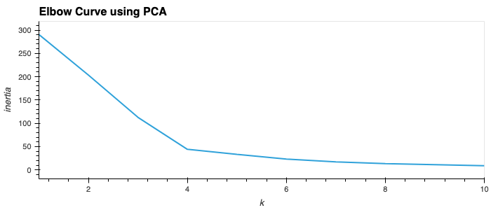

# Cryptocurrency Trend Analysis: Clustering with K-means and Dimensionality Reduction via PCA

## Introduction

This project explores clustering methods to analyze trends in cryptocurrency prices, focusing on short-term price changes over 24 hours and 7 days. The goal is to identify clusters of cryptocurrencies with similar performance characteristics to help in market segmentation and understanding volatility. 

To achieve this, we use:
- **K-means clustering** for grouping cryptocurrencies.
- **Principal Component Analysis (PCA)** for dimensionality reduction, which captures the main variance in the data with fewer features.

---

## Table of Contents

1. [Data Loading and Initial Exploration](#data-loading-and-initial-exploration)
2. [Clustering with K-means Using Original Features](#clustering-with-k-means-using-original-features)
3. [Dimensionality Reduction with PCA](#dimensionality-reduction-with-pca)
4. [Clustering with PCA-Transformed Data](#clustering-with-pca-transformed-data)
5. [Comparison of Results](#comparison-of-results)
6. [Conclusion and Insights](#conclusion-and-insights)

---

## Data Loading and Initial Exploration

We load the cryptocurrency market data into a Pandas DataFrame, which includes columns for each cryptocurrency’s percentage price changes over various timeframes. Here, we examine the distribution and trends in the data:

---

## Clustering with K-means Using Original Features

### Elbow Method to Determine Optimal k

To find the optimal number of clusters (\( k \)), we use the **Elbow Method**. This method plots inertia (the sum of squared distances from each point to its cluster center) against various \( k \) values. The “elbow” point, where the rate of inertia decrease slows, indicates the optimal \( k \).

From the elbow plot, we identify that **\( k=4 \)** is an optimal choice for clustering with the original dataset.

### Cluster Visualization

With \( k=4 \), we fit the K-means model to the scaled data and create a scatter plot. The x-axis represents **24-hour price change**, and the y-axis represents **7-day price change**. Each data point is a cryptocurrency, color-coded by cluster.

---

## Dimensionality Reduction with PCA

### PCA Transformation and Explained Variance

To simplify the dataset, we apply **Principal Component Analysis (PCA)**, reducing the data to three principal components while capturing **89.50%** of the original variance. This transformation maintains most of the information in a reduced form, making clustering more efficient.

### Rationale for Using PCA

By reducing dimensionality, PCA enhances interpretability and removes noise, focusing the clustering process on the most significant features.

---

## Clustering with PCA-Transformed Data

### Elbow Method Re-evaluation

Using the PCA-transformed data, we re-evaluate the optimal \( k \) with the elbow method. Interestingly, the elbow curve suggests the same \( k=4 \), indicating a stable clustering structure across both the original and PCA-transformed datasets.

### PCA-Based Cluster Visualization

We perform K-means clustering with \( k=4 \) on the PCA-transformed data and visualize the clusters using combinations of the principal components:
1. **PC1 vs. PC2**
2. **PC1 vs. PC3**
3. **PC2 vs. PC3**

These plots offer different perspectives on the clustering structure within the reduced space.

---

## Comparison of Results

To assess the impact of PCA on clustering, we compare:
1. **Elbow Curves** for the original and PCA-transformed data.
2. **Cluster Plots** to see the distribution differences between clustering based on original features and PCA-transformed features.

### Elbow Curve Comparison

### Cluster Plot Comparison

---

## Conclusion and Insights

This analysis shows that clustering cryptocurrencies with K-means, combined with PCA, can effectively group assets with similar short-term price movement patterns. Key takeaways include:

- **Consistent Optimal k**: Both the original and PCA-transformed data suggest \( k=4 \) as the optimal cluster count.
- **Effective Dimensionality Reduction**: PCA captures nearly 90% of the variance in three components, simplifying the data while preserving essential information.
- **Compact Clusters with PCA**: The PCA-based clusters are more compact, suggesting that PCA helps to reduce noise and improve interpretability.

Future work could involve adding features like trading volume or market cap and experimenting with other clustering algorithms to validate these findings.

--- 